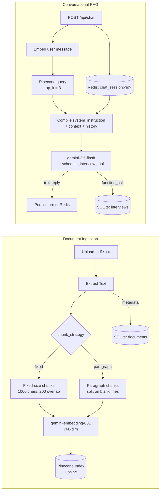

# PalmMind RAG Backend

An asynchronous FastAPI backend that implements a **custom Retrieval-Augmented Generation (RAG) pipeline** — document ingestion with configurable chunking, semantic vector search, stateful multi-turn conversation memory, and autonomous interview scheduling via native LLM tool calling. The entire orchestration layer is hand-built on top of the Gemini SDK; no RAG framework (LangChain, LlamaIndex, etc.) is used anywhere in the request path.

| | |
|---|---|
| **Runtime** | Python 3.10+, fully asynchronous end-to-end (`async`/`await`) |
| **API Layer** | FastAPI |
| **Generation Model** | `gemini-2.5-flash` (text generation + native function calling) |
| **Embedding Model** | `gemini-embedding-001` (768-dimensional vectors) |
| **Vector Store** | Pinecone (Cosine similarity) |
| **Relational Store** | SQLite3 via SQLAlchemy 2.0 async engine + `aiosqlite` |
| **Session Memory** | Redis (async client, sliding 24h TTL) |

---

## Table of Contents

- [Tech Stack](#tech-stack)
- [Architecture Overview](#architecture-overview)
- [Key Features](#key-features)
  - [1. Document Ingestion](#1-document-ingestion)
  - [2. Custom RAG Pipeline](#2-custom-rag-pipeline)
  - [3. Multi-Turn Session Memory](#3-multi-turn-session-memory)
  - [4. Agentic Tool Calling](#4-agentic-tool-calling)
- [Project Structure](#project-structure)
- [Local Setup](#local-setup)
- [End-to-End Testing & Verification Guide](#end-to-end-testing--verification-guide)
- [Inspecting the Local Database](#inspecting-the-local-database)
- [Design Notes](#design-notes)

---

## Tech Stack

| Layer | Technology | Version |
|---|---|---|
| API Framework | FastAPI | `0.136.3` |
| ASGI Server | Uvicorn | `0.49.0` |
| Multipart Uploads | python-multipart | `0.0.31` |
| LLM / Embeddings SDK | google-genai | `1.35.0` |
| Validation / Settings | pydantic / pydantic-settings | `2.13.4` / `2.14.1` |
| PDF Parsing | pypdf | `6.13.0` |
| Session Memory | redis (async client) | `8.0.0` |
| Vector Database | pinecone | latest |
| ORM / Async Engine | SQLAlchemy | `2.0.49` |
| SQLite Async Driver | aiosqlite | `0.22.1` |
| Env Management | python-dotenv | `1.2.2` |

---

## Architecture Overview



---

## Key Features

### 1. Document Ingestion

**Endpoint:** `POST /api/documents/upload` (`multipart/form-data`)

- Accepts `.pdf` or `.txt` files only; any other extension returns `400`.
- `.txt` files are decoded directly as UTF-8. `.pdf` files are parsed page-by-page with `pypdf.PdfReader`, concatenating extracted text across pages.
- Two explicit, selectable chunking strategies (`chunk_strategy` form field, defaults to `paragraph`):
  - **`fixed`** — sliding-window chunking at **1000 characters with a 200-character overlap**, preserving context across chunk boundaries.
  - **`paragraph`** — splits on blank lines (`\n\n`), trims whitespace, and discards fragments under 10 characters.
- A `Document` row (`filename`, `file_type`, `chunk_strategy`, `created_at`) is committed to SQLite **before** embedding, so the chunk-to-document relationship is established up front.
- All chunks for a document are embedded in a **single batched call** to `gemini-embedding-001` with `output_dimensionality=768`, then upserted into Pinecone as individual vectors (`doc_<document_id>_chunk_<i>_<uuid8>`) carrying `document_id`, `filename`, and the raw chunk text as metadata.
- Response includes `document_id`, `chunks_processed`, and `strategy_used` for immediate verification.

### 2. Custom RAG Pipeline

**Endpoint:** `POST /api/chat`

Built natively in `app/services/rag.py` — no `RetrievalQAChain` or similar abstraction. Each request:

1. Embeds the incoming `message` with `gemini-embedding-001`.
2. Queries Pinecone (`top_k=3`, `include_metadata=True`) and joins the matched chunk texts with a `---` separator into a single context block.
3. Pulls the last 6 stored turns for the session from Redis and replays them as Gemini `Content` objects ahead of the current turn.
4. Manually compiles a `system_instruction` string embedding the retrieved context **and** an explicit directive that scheduling intents must be handled via function call, never plain text.
5. Calls `gemini-2.5-flash` with `tools=[schedule_interview_tool]` and `temperature=0.2`.
6. Branches on `response.function_calls`: a triggered tool call routes to the booking flow (see §4); otherwise `response.text` is returned as the answer.

### 3. Multi-Turn Session Memory

Implemented in `app/services/memory.py` using Redis list operations:

- Each session is keyed as `chat_session:<session_id>`.
- Every user and model turn is `RPUSH`-ed as a JSON object (`{"role": ..., "content": ...}`).
- The key's TTL is refreshed to **86,400 seconds (24 hours)** on every write — a rolling expiration rather than a fixed one.
- `LRANGE key -6 -1` retrieves the most recent 6 stored entries (i.e. the last 3 user/assistant exchanges), which are replayed into the Gemini request — giving short-term conversational grounding without resending the full transcript on every call.

### 4. Agentic Tool Calling

`schedule_interview_tool(name, email, date, time)` is a plain Python function with type hints and a docstring, passed directly into Gemini's `tools` parameter — the SDK introspects the signature to build the function schema; no manual JSON schema is hand-written.

- The `system_instruction` explicitly forbids the model from confirming a booking in free text, forcing it down the function-call path whenever scheduling details are present.
- On a tool call, the backend extracts `name`/`email`/`date`/`time` from `call.args`:
  - If any field is missing, it returns a clarifying follow-up **without** writing to the database.
  - If all four are present, it commits a new `Interview` row to SQLite within the same async session used to serve the chat request, then returns a natural-language confirmation generated by the backend (not raw model output).

---

## Project Structure

```
palmmind-rag-backend/
├── app/
│   ├── api/
│   │   ├── chat.py            # POST /api/chat
│   │   └── document.py        # POST /api/documents/upload
│   ├── core/
│   │   └── config.py          # Pydantic Settings, loaded from .env
│   ├── db/
│   │   ├── relational.py      # Async SQLAlchemy engine + session factory
│   │   └── vector_store.py    # Pinecone client / index accessor
│   ├── models/
│   │   └── schemas.py         # Document & Interview ORM models, Chat DTOs
│   ├── services/
│   │   ├── ingestion.py       # Text extraction + chunking strategies
│   │   ├── enbedding.py       # Gemini embedding + Pinecone upsert
│   │   ├── memory.py          # Redis session history
│   │   └── rag.py             # RAG orchestration + tool calling
│   └── main.py                # FastAPI app, lifespan hook, router registration
├── requirements.txt
└── .env                        # not committed — see Local Setup
```

---

## Local Setup

### Prerequisites

- Python 3.10+
- A reachable Redis instance
- A Gemini API key
- A **Pinecone index created in advance** with `dimension = 768` and `metric = cosine` — the application connects to an existing index by name; it does not provision one at startup.

### 1. Clone the repository

```bash
git clone https://github.com/Bishesh-ops/palmmind-rag-backend.git
cd palmmind-rag-backend
```

### 2. Configure environment variables

Create a `.env` file in the project root:

```env
# Google Gemini
GEMINI_API_KEY=your_gemini_api_key_here

# Pinecone — index must already exist with dimension=768, metric=cosine
PINECONE_API_KEY=your_pinecone_api_key_here
PINECONE_INDEX_NAME=palmmind-rag

# Redis — multi-turn session memory
REDIS_URL=redis://localhost:6379

# SQLite — async engine
DATABASE_URL=sqlite+aiosqlite:///./palmmind.db
```

### 3. Create a virtual environment & install dependencies

```bash
python -m venv venv
source venv/bin/activate        # Windows: venv\Scripts\activate
pip install -r requirements.txt
```

### 4. Start Redis and verify it's reachable

```bash
redis-server --port 6379
```

In a separate terminal:

```bash
redis-cli ping
# PONG
```

### 5. Run the API server

```bash
uvicorn app.main:app --reload
```

The app's `lifespan` hook creates the `documents` and `interviews` tables in `palmmind.db` automatically on first startup — no manual migration step is needed.

### 6. Open the interactive API docs

```
http://localhost:8000/docs
```

A lightweight liveness check is also available at `GET /health`, returning `{"status": "healthy", "project": "PalmMind RAG Backend"}`.

---

## End-to-End Testing & Verification Guide

All three lifecycle stages can be exercised directly from Swagger UI (`/docs`) — no separate client required.

### Step 1 — Document Upload

1. Expand `POST /api/documents/upload` → **Try it out**.
2. Under `file`, choose a `.pdf` or `.txt` containing factual content you can later question the assistant about.
3. Set `chunk_strategy` to `fixed` or `paragraph` (omit to default to `paragraph`).
4. Click **Execute**.
5. A `200` response returns `document_id`, `chunks_processed`, and `strategy_used` — the content is now embedded in Pinecone and logged in the `documents` table.

> Tip: upload the same content under both strategies as separate files to compare retrieval quality.

### Step 2 — Contextual Querying & Memory Retention

1. Expand `POST /api/chat` → **Try it out**.
2. Send an initial message referencing the uploaded content under a fixed `session_id`:

```json
{
  "session_id": "test-session-001",
  "message": "What does the document say about <topic from your file>?"
}
```

3. Confirm the `response` reflects content actually present in your file — this verifies the Pinecone similarity search is feeding real context into Gemini, not a generic answer.
4. In the **same session**, send a follow-up that depends on the prior answer without restating the topic, e.g. `"Summarize that in one sentence."`
5. A coherent, context-aware reply confirms Redis is correctly replaying prior turns. You can verify directly:

```bash
redis-cli LRANGE chat_session:test-session-001 0 -1
```

### Step 3 — Appointment Booking via Tool Calling

1. In the same or a new `session_id`, send a message containing all four required fields:

```json
{
  "session_id": "test-session-001",
  "message": "I'd like to book an interview. My name is Jane Doe, email jane.doe@example.com, on 2026-07-01 at 10:00 AM."
}
```

2. Gemini detects the scheduling intent and emits a `function_call` to `schedule_interview_tool` instead of free text. The backend intercepts it, parses `name`/`email`/`date`/`time`, and commits a row to `interviews`.
3. The API responds with a backend-generated confirmation (e.g. *"Perfect! I have successfully scheduled your interview..."*).
4. To test the guardrail, send a partial request (e.g. only a name and date) — the assistant should ask a clarifying follow-up rather than writing an incomplete row.

---

## Inspecting the Local Database

With the server stopped (or from a separate terminal), open the SQLite file directly:

```bash
sqlite3 palmmind.db
```

Enable readable tabular output:

```sql
.mode table
.headers on
```

Inspect ingested documents:

```sql
SELECT id, filename, file_type, chunk_strategy, created_at FROM documents;
```

Inspect booked interviews:

```sql
SELECT id, name, email, date, time, created_at FROM interviews;
```

Exit with `.quit`.

---

## Design Notes

- **No RAG framework dependency.** `app/services/rag.py` manually composes the system instruction, Pinecone-retrieved context, and Redis-sourced history into a single Gemini request payload — deliberately avoiding LangChain/LlamaIndex abstractions.
- **Tool calling is the source of truth for bookings.** The model is explicitly instructed never to confirm a booking in plain text, so the only path to a write transaction is a validated `function_call` — preventing a confirmed-sounding reply from existing without a corresponding row in `interviews`.
- **Pinecone index lifecycle is external to the app.** The service connects to an existing index by name rather than provisioning one at startup, so the index must be created out-of-band with a dimensionality matching the embedding model (768).
